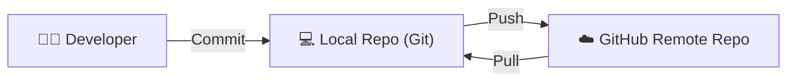
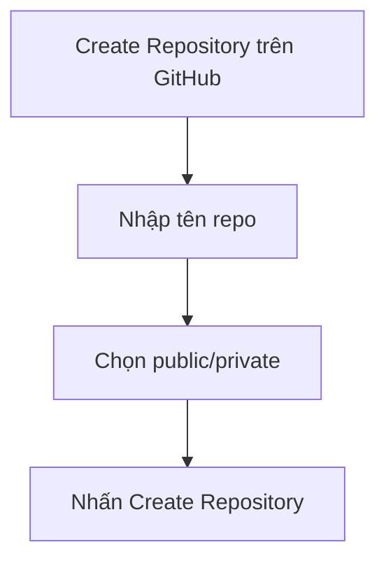
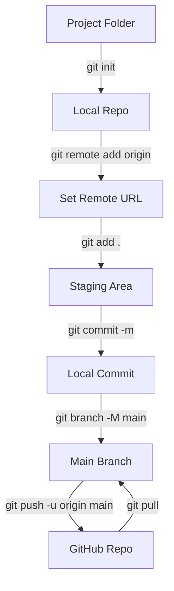
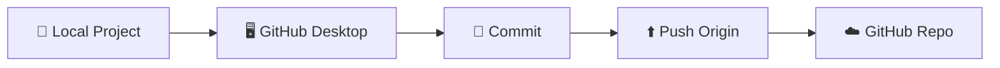
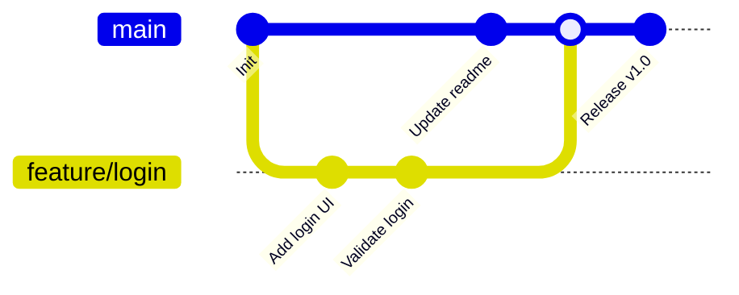
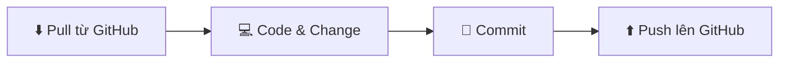

# Git & GitHub

---

## 1. Giới thiệu

* **Git**: Công cụ quản lý phiên bản (VCS) → theo dõi lịch sử thay đổi code.
* **GitHub**: Nền tảng lưu trữ code online, hỗ trợ làm việc nhóm.
* **GitHub Desktop**: Ứng dụng GUI để thao tác Git mà không cần CLI.

👉 **Mục tiêu**: Cài đặt Git/GitHub, tạo repo và push dự án đầu tiên.

### Sơ đồ tổng quan



---

## 2. Cài đặt Git

* Tải Git: [https://git-scm.com/downloads](https://git-scm.com/downloads)
* Cài đặt theo OS (Windows/Mac/Linux).

```bash
git --version
git config --global user.name "Tên của bạn"
git config --global user.email "Email GitHub của bạn"
```

---

## 3. Cài đặt GitHub Desktop

* Tải: [https://desktop.github.com/](https://desktop.github.com/)
* Đăng nhập GitHub account.
* GitHub Desktop tự nhận user/email từ Git.

---

## 4. Tạo Repository trên GitHub

1. Vào GitHub → **New Repository**.
2. Đặt tên, chọn public/private.
3. Create repository.

### Sơ đồ



---

## 5. Push dự án đầu tiên (Command line)

```bash
cd my-project
git init
git remote add origin https://github.com/username/my-first-project.git
git add .
git commit -m "First commit"
git branch -M main
git push -u origin main
```

### Sơ đồ luồng



---

## 6. Push bằng GitHub Desktop

1. Add Local Repository hoặc Clone Repository.
2. Commit thay đổi.
3. Push origin.

### Sơ đồ GitHub Desktop



---

## 7. Quản lý thay đổi

### Commit

```bash
git commit -m "Thêm chức năng đăng nhập"
```

### Pull

```bash
git pull origin main
```

### Branch

```bash
git checkout -b feature/login
git push origin feature/login
```

### Sơ đồ branch (Git Flow cơ bản)



---

## 8. Demo thực hành

1. Cài Git + GitHub Desktop.
2. Tạo repo mới.
3. Viết file `index.html` với nội dung "Hello GitHub".
4. Push lên GitHub.
5. Chỉnh sửa file → Commit → Push → Xem kết quả.

---

## 9. Tổng kết

* **Git** = quản lý phiên bản cục bộ.
* **GitHub** = lưu trữ code online + cộng tác.
* **GitHub Desktop** = thao tác trực quan hơn.

### Chu trình chuẩn


