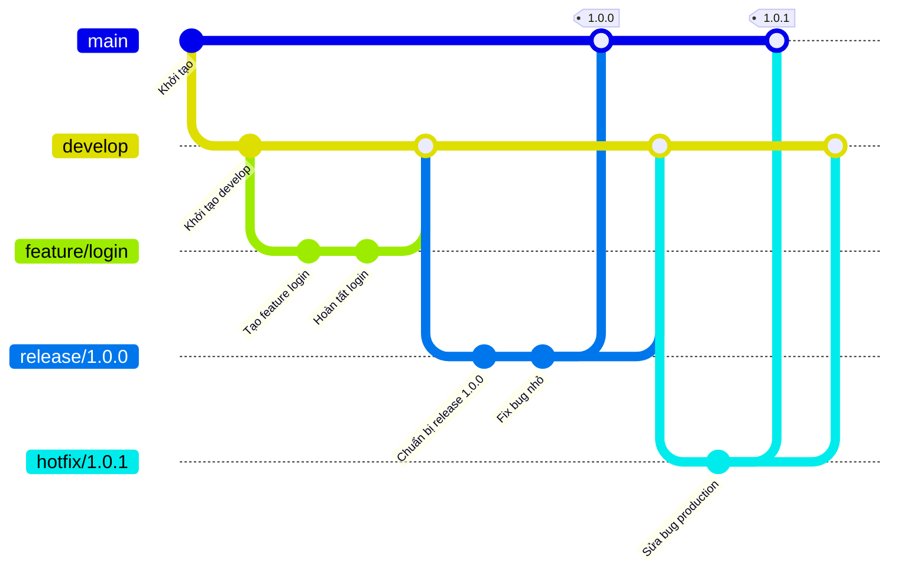

# Git Flow

## 1. Giới thiệu

* **Git Flow** là một mô hình quản lý nhánh trong Git.
* Nó được Vincent Driessen giới thiệu năm 2010 và nhanh chóng trở thành workflow phổ biến.
* Phù hợp cho các dự án có **chu kỳ release rõ ràng** và **team đông người**.

---

## 2. Các loại nhánh trong Git Flow

* **`main` (hoặc master)**
  → Chứa code production, luôn ổn định.

* **`develop`**
  → Nhánh phát triển chính, tích hợp code từ các feature.

* **`feature/*`**
  → Dùng để phát triển tính năng mới, tách riêng từ `develop`.

* **`release/*`**
  → Chuẩn bị phát hành phiên bản mới, fix bug nhẹ, cập nhật doc.

* **`hotfix/*`**
  → Sửa lỗi khẩn cấp trên production (`main`).

---

## 3. Quy trình làm việc

1. **Bắt đầu tính năng**

   ```bash
   git flow feature start login-feature
   git flow feature finish login-feature
   ```

2. **Chuẩn bị release**

   ```bash
   git flow release start 1.0.0
   git flow release finish 1.0.0
   ```

3. **Hotfix khẩn cấp**

   ```bash
   git flow hotfix start fix-critical-bug
   git flow hotfix finish fix-critical-bug
   ```

---

## 4. Ưu và nhược điểm

**Ưu điểm**

* Quản lý nhánh rõ ràng.
* Hỗ trợ quy trình release bài bản.
* Giúp team đông người tránh conflict lung tung.

**Nhược điểm**

* Nặng nề cho team nhỏ.
* Không phù hợp với CI/CD kiểu deploy liên tục.

---

## 5. Sơ đồ Git Flow (Mermaid)



