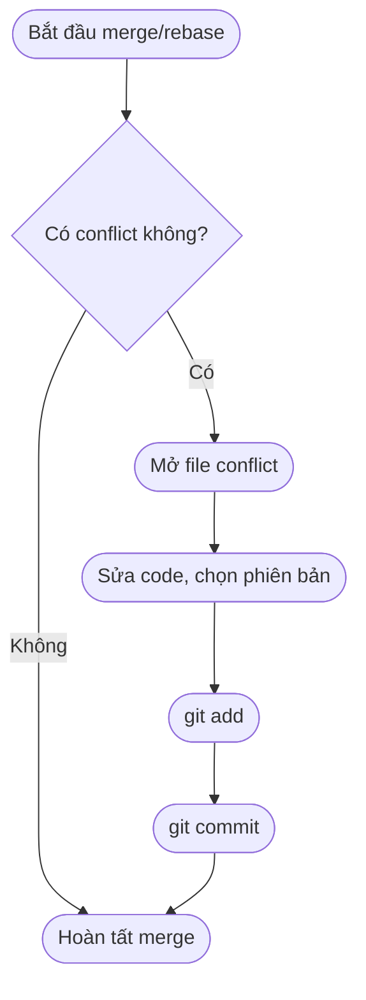

# Xử lý Conflict trong Git

## 1. Conflict là gì?
- **Conflict (xung đột)** xảy ra khi Git **không thể tự động merge** code giữa các nhánh.  
- Thường xảy ra khi:
  - Hai người sửa **cùng một dòng** trong một file.
  - Một người **xóa file**, người khác lại sửa file đó.
  - Merge, rebase, cherry-pick có thay đổi trùng nhau.

---

## 2. Ví dụ đơn giản
Giả sử có file `hello.txt` với nội dung:

```txt
Hello World
```

- **Nhánh A** sửa thành:
  ```txt
  Hello Git
  ```
- **Nhánh B** sửa thành:
  ```txt
  Hello Flow
  ```

Khi merge, Git không biết chọn cái nào → conflict.

---

## 3. Khi conflict xảy ra
Git sẽ chèn ký hiệu đặc biệt vào file:

```txt
<<<<<<< HEAD
Hello Git
=======
Hello Flow
>>>>>>> branch-b
```

- Phần trên `=======` là code từ nhánh hiện tại.  
- Phần dưới là code từ nhánh merge vào.  

---

## 4. Cách xử lý Conflict

### Bước 1: Mở file bị conflict
Tìm các đoạn có `<<<<<<<`, `=======`, `>>>>>>>`.

### Bước 2: Quyết định giữ gì
- Giữ phiên bản `HEAD` (của bạn).
- Giữ phiên bản `incoming` (nhánh kia).
- Hoặc **tự sửa** để kết hợp cả hai.

Ví dụ sau khi xử lý:

```txt
Hello Git Flow
```

### Bước 3: Đánh dấu đã resolve
```bash
git add hello.txt
```

### Bước 4: Hoàn tất merge
```bash
git commit
```

---

## 5. Công cụ hỗ trợ
- `git status` → xem file nào đang conflict.  
- `git diff` → so sánh sự khác biệt.  
- IDE/Editor hỗ trợ: VSCode, PhpStorm, IntelliJ... có giao diện chọn dễ dàng.  

---

## 6. Flow xử lý Conflict



---

## 7. Kinh nghiệm tránh conflict
- **Pull code thường xuyên** từ `develop/main`.  
- Chia nhỏ commit, tránh thay đổi nhiều file cùng lúc.  
- Thống nhất code style (lint, prettier).  
- Giao tiếp với team: ai làm phần nào.  

---

## 8. Kết luận
- Conflict là chuyện bình thường trong teamwork, **không phải lỗi**.  
- Quan trọng là biết đọc file conflict và **quyết định hợp lý**.  
- Dùng công cụ hỗ trợ sẽ giúp nhanh hơn, tránh sai sót.
```

