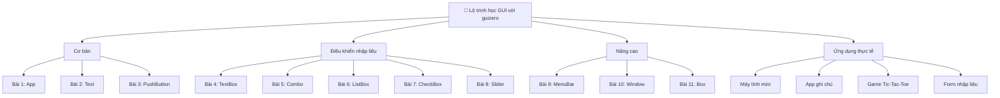

# Bắt đầu

---

## 1. GUI là gì?

**GUI (Graphical User Interface – Giao diện người dùng đồ họa)** là cách để con người tương tác với máy tính thông qua **cửa sổ, nút bấm, biểu tượng, menu** thay vì chỉ dùng dòng lệnh.

* **Ví dụ GUI quen thuộc**: Windows, macOS, ứng dụng điện thoại.
* **Khác với CLI (Command Line Interface)**: GUI trực quan, dễ sử dụng; CLI đòi hỏi nhớ lệnh.

👉 Với Python, có nhiều thư viện để tạo GUI (Tkinter, PyQt, Kivy). Trong đó **guizero** nổi bật vì **đơn giản – dễ học – phù hợp cho người mới bắt đầu**.

---

## 2. Lịch sử phát triển GUI

| Năm      | Sự kiện quan trọng                                                                                             |
| -------- | -------------------------------------------------------------------------------------------------------------- |
| 1968     | Douglas Engelbart giới thiệu chuột và giao diện tương tác trong *Mother of All Demos*.                         |
| 1973     | Xerox Alto – máy tính đầu tiên có GUI.                                                                         |
| 1984     | Apple Macintosh phổ biến GUI rộng rãi đến công chúng.                                                          |
| 1990s    | Microsoft Windows trở thành hệ điều hành phổ biến nhất với GUI.                                                |
| Ngày nay | GUI có mặt trong **ứng dụng desktop, web, mobile, IoT**. Với Python, GUI giúp tạo ứng dụng nhanh và tiện dụng. |

---

## 3. Giới thiệu guizero

* **guizero** là thư viện Python xây dựng dựa trên **Tkinter**, nhưng đơn giản hơn nhiều.
* Mục tiêu: giúp **người mới học lập trình** dễ dàng tạo ứng dụng GUI.
* Hỗ trợ: Windows, macOS, Linux, Raspberry Pi.

Ví dụ đơn giản:

```python
from guizero import App, Text

app = App("Xin chào GUI")
text = Text(app, text="Hello World!")
app.display()
```

---

## 4. Lộ trình học tập

| Giai đoạn    | Nội dung học                                    | Kết quả đạt được                        |
| ------------ | ----------------------------------------------- | --------------------------------------- |
| **Bài 1–2**  | Giới thiệu App, Text                            | Tạo ứng dụng cơ bản hiển thị chữ.       |
| **Bài 3–5**  | PushButton, TextBox, Combo                      | Làm việc với nút bấm, nhập dữ liệu.     |
| **Bài 6–8**  | ListBox, CheckBox, Slider                       | Xử lý lựa chọn và dữ liệu phức tạp hơn. |
| **Bài 9–11** | MenuBar, Window, Box                            | Quản lý nhiều cửa sổ và bố cục.         |
| **Bài 12+**  | Dự án thực tế: máy tính mini, ghi chú, game nhỏ | Xây dựng ứng dụng hoàn chỉnh.           |

---

## 5. Phương pháp học

* **Học qua ví dụ**: mỗi khái niệm đều có code minh họa.
* **Học qua dự án nhỏ**: áp dụng kiến thức ngay vào ứng dụng.
* **Sơ đồ + hình ảnh**: mô tả trực quan luồng xử lý.
* **Bài tập tự luyện**: nâng cao tư duy lập trình.

---

## 6. Kết quả đạt được sau khóa học

* Hiểu rõ **khái niệm GUI** và cách hoạt động.
* Sử dụng **guizero** để tạo ứng dụng Python có giao diện đẹp.
* Xây dựng được các **ứng dụng nhỏ hữu ích**: máy tính bỏ túi, game tic-tac-toe, form nhập liệu, ứng dụng ghi chú.
* Có nền tảng để học tiếp các GUI nâng cao (PyQt, Kivy, Flask cho web).

---

## 7. Tài liệu tham khảo

* Trang chủ guizero: [https://lawsie.github.io/guizero/](https://lawsie.github.io/guizero/)
* Python chính thức: [https://docs.python.org/3/](https://docs.python.org/3/)
* Tkinter (nền tảng của guizero): [https://docs.python.org/3/library/tk.html](https://docs.python.org/3/library/tk.html)
* Hướng dẫn guizero nâng cao: [https://github.com/lawsie/guizero](https://github.com/lawsie/guizero)




