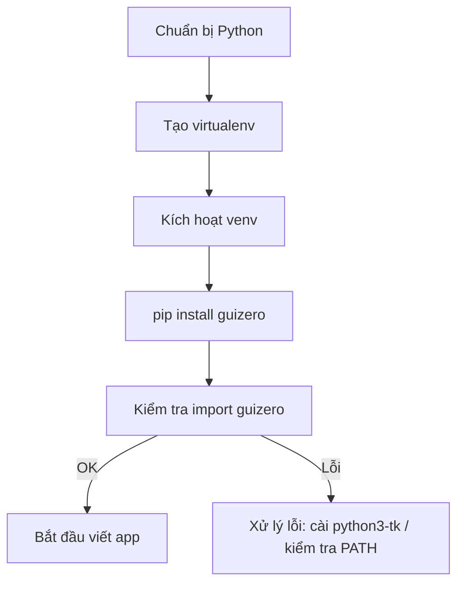

# Bài 1 - Giới thiệu và Cài đặt


## Mục tiêu bài học

Sau khi hoàn thành bài này bạn sẽ:

* Biết chuẩn bị môi trường (Python + pip + virtualenv) để dùng guizero.
* Cài đặt thư viện `guizero` và các phụ thuộc cần thiết.
* Chạy được chương trình GUI cơ bản (hello world).
* Biết cách xử lý lỗi cài đặt thường gặp.

---

## Yêu cầu trước

* Máy có Python 3 (đã cài sẵn `python3` / `python`), tốt nhất dùng Python 3.7+.
* Trình soạn thảo: VS Code, Thonny, PyCharm hoặc Notepad++.
* Quyền cài đặt phần mềm (admin/sudo) nếu cần cài gói hệ thống (ví dụ `python3-tk` trên Linux).
* Kết nối internet để cài gói bằng `pip`.

---

## 1) Chuẩn bị môi trường (khuyến nghị: virtual environment)

Tạo và kích hoạt virtualenv để môi trường sạch:

Windows (PowerShell):

```powershell
python -m venv venv
.\venv\Scripts\Activate.ps1
```

Windows (cmd):

```cmd
python -m venv venv
venv\Scripts\activate
```

macOS / Linux:

```bash
python3 -m venv venv
source venv/bin/activate
```

Khi kích hoạt, prompt sẽ hiển thị `(venv)`.

---

## 2) Cài guizero và (nếu cần) Tkinter

1. Cài guizero:

```bash
pip install guizero
```

2. Vấn đề về Tkinter (GUI của guizero dựa trên Tkinter/Tk):

* **Ubuntu/Debian** (nếu import báo lỗi liên quan tk):

  ```bash
  sudo apt-get update
  sudo apt-get install python3-tk
  ```
* **Fedora** (nếu cần):

  ```bash
  sudo dnf install python3-tkinter
  ```
* **Arch/Manjaro**:

  ```bash
  sudo pacman -S tk
  ```
* **macOS**: thường Python từ python.org hoặc Homebrew có Tk đi kèm; nếu không, có thể cài `tcl-tk` bằng Homebrew:

  ```bash
  brew install tcl-tk
  ```

  (với Homebrew, đôi khi cần cài Python liên kết với Homebrew `tcl-tk`)

> Ghi chú: lỗi liên quan Tk thường biểu hiện dưới dạng `TclError` hoặc `ModuleNotFoundError: No module named '_tkinter'`. Nếu bạn gặp lỗi đó, kiểm tra việc cài Tk/Tkinter cho distro tương ứng.

---

## 3) Kiểm tra cài đặt nhanh

Tạo file `check_guizero.py`:

```python
try:
    import guizero
    print("guizero imported OK")
except Exception as e:
    print("Lỗi khi import guizero:", e)
```

Chạy:

```bash
python check_guizero.py
```

Nếu thấy `guizero imported OK` là ổn.

---

## 4) Ví dụ minh họa: Hello World (đơn giản, đủ chạy)

Tạo file `hello_guizero.py`:

```python
from guizero import App, Text, PushButton

def on_click():
    greeting.value = "Bạn đã nhấn nút!"

app = App(title="Xin chào GUIZERO", width=420, height=180)
greeting = Text(app, text="Xin chào, thế giới!", size=14)
btn = PushButton(app, text="Nhấn tôi", command=on_click)
app.display()
```

Chạy:

```bash
python hello_guizero.py
```

Hành vi: cửa sổ hiện tiêu đề, nội dung text và nút. Khi nhấn nút, text đổi thành `"Bạn đã nhấn nút!"`.

> Lưu ý: mình tránh gọi hàm đóng cửa sổ tự động để giữ ví dụ đơn giản. Sau khi hiểu rõ hơn, ta sẽ học cách đóng/điều khiển cửa sổ.

---

## 5) Sơ đồ (Mermaid) — dùng trong tài liệu/slide

### 5.1 Luồng cài đặt



### 5.2 Vòng đời ứng dụng GUI đơn giản

```mermaid
flowchart TD
  S[Bắt đầu chương trình] --> C[Tạo App()]
  C --> W[Thêm widget (Text, Button...)]
  W --> E[Cài đặt callback]
  E --> D[app.display()]
  D --> U[Người dùng tương tác]
  U -->|đóng| X[Kết thúc chương trình]
```

---

## 6) Gợi ý hình ảnh minh hoạ (không dùng icon)

Mỗi ảnh là gợi ý bạn có thể chuẩn bị để chèn vào giáo trình/slide:

* Ảnh 1: **Terminal** (hoặc PowerShell) hiển thị lệnh `pip install guizero` và kết quả cài đặt.
* Ảnh 2: **VS Code** hoặc editor mở file `hello_guizero.py` (mã nguồn nhìn rõ).
* Ảnh 3: **Ảnh chụp màn hình ứng dụng**: cửa sổ GUI đơn giản, có tiêu đề `"Xin chào GUIZERO"`, text và một nút.
* Ảnh 4: **Sơ đồ flowchart** (có thể là hình PNG xuất từ Mermaid hoặc vẽ bằng draw\.io) cho luồng cài đặt.
* Ảnh 5 (tùy chọn): màn hình hiển thị lỗi phổ biến (ví dụ terminal hiện `ModuleNotFoundError: No module named '_tkinter'`) cùng chú thích cách khắc phục bên cạnh.

> Gợi ý: dùng ảnh PNG/JPEG kích thước vừa phải (800–1200 px wide) để hiển thị rõ trên slide hoặc tài liệu in.

---

## 7) Mẹo & xử lý lỗi thường gặp

* **Lỗi**: `ModuleNotFoundError: No module named 'guizero'`
  → Hãy chắc đang ở đúng virtualenv; chạy `pip show guizero` hoặc `pip install guizero` trong env hiện hành.

* **Lỗi**: `_tkinter` hoặc `TclError: no display name and no $DISPLAY`
  → Trên Linux: cần cài `python3-tk`. Trường hợp SSH vào server headless: cần X11 forwarding (`ssh -X`) hoặc dùng môi trường ảo/Xvfb.

* **Cảnh báo/GUI chạy chậm**: tránh import nặng trên callback chính; giữ UI thread nhẹ — trong bài sau ta sẽ bàn về threading/ngăn treo UI.

* **Hình ảnh không hiện** trong `Picture(app, image="...")` → kiểm tra đường dẫn file, định dạng (PNG, GIF, JPG) và quyền đọc.

---

## 8) Cấu trúc dự án mẫu

Gợi ý cây thư mục nhỏ:

```
gui-zero-course/
├─ venv/                   # virtualenv (không push lên git)
├─ lesson1/
│  ├─ hello_guizero.py
│  ├─ check_guizero.py
│  └─ images/
│      └─ sample.png
└─ README.md
```

---

## 9) Bài tập (từ dễ -> nâng cao)

**Bài tập 1.1 (cơ bản)**

* Tạo virtualenv, cài `guizero`. Chạy `check_guizero.py`.

**Bài tập 1.2 (thực hành code)**

* Tạo file `hello2.py` từ ví dụ Hello World, chỉnh tiêu đề thành `"Luyện tập GUIZERO - Bài 1"`, thay chữ trong Text thành tên của bạn, thay đổi kích thước cửa sổ width=500, height=220.

**Bài tập 1.3 (tương tác nhỏ)**

* Thêm 2 nút: một nút đặt `greeting.value = "Bạn đã nhấn nút A"`, nút kia đặt `greeting.value = "Bạn đã nhấn nút B"`.

**Bài tập 1.4 (ảnh trong cửa sổ)**

* Thêm widget `Picture` để hiển thị một ảnh `images/sample.png`. Nếu không có ảnh, dùng ảnh nhỏ 200x150 px.

**Bài tập 1.5 (gợi ý nâng cao, tùy chọn)**

* Viết chương trình có 2 Text hiển thị (một static label, một dynamic). Khi nhấn nút, dynamic text thay đổi theo thời gian (vd: hiển thị thời gian hiện tại). (Sử dụng `import time` và cập nhật text trong callback).

---

## 10) Đáp án / gợi ý cho bài tập

**Bài 1.2** (`hello2.py`):

```python
from guizero import App, Text, PushButton

def on_click():
    greeting.value = "Bạn đã nhấn nút!"

app = App(title="Luyện tập GUIZERO - Bài 1", width=500, height=220)
greeting = Text(app, text="Nguyễn Văn A", size=14)
btn = PushButton(app, text="Nhấn tôi", command=on_click)
app.display()
```

**Bài 1.3**:

```python
from guizero import App, Text, PushButton

def click_a():
    greeting.value = "Bạn đã nhấn nút A"

def click_b():
    greeting.value = "Bạn đã nhấn nút B"

app = App(title="Hai nút", width=420, height=180)
greeting = Text(app, text="Chọn một nút", size=12)
btn_a = PushButton(app, text="Nút A", command=click_a)
btn_b = PushButton(app, text="Nút B", command=click_b)
app.display()
```

**Bài 1.4** (hiển thị ảnh):

```python
from guizero import App, Picture

app = App(title="Ảnh minh họa", width=400, height=300)
Picture(app, image="images/sample.png")
app.display()
```

(Chú ý: `images/sample.png` là đường dẫn tương đối; đặt file ảnh vào thư mục đó.)

---

## 11) Gợi ý tài liệu tham khảo & bước tiếp theo

* Sau khi nắm Bài 1, sang **Bài 2** ta sẽ học **Cửa sổ cơ bản & thêm widget Text/PushButton/Picture chi tiết**, cách sắp xếp widget (layout cơ bản) và giới thiệu `Window`.
* Nên chuẩn bị: một vài ảnh demo (PNG), môi trường dev (VS Code), và sẵn sàng thử sửa code.

---

## 12) Tóm tắt nhanh (1 dòng)

Cài `guizero` bằng pip, đảm bảo Tkinter có trên hệ, chạy file `hello_guizero.py` để thấy cửa sổ GUI đầu tiên — từ đó ta sẽ mở rộng dần các widget và xử lý sự kiện.

