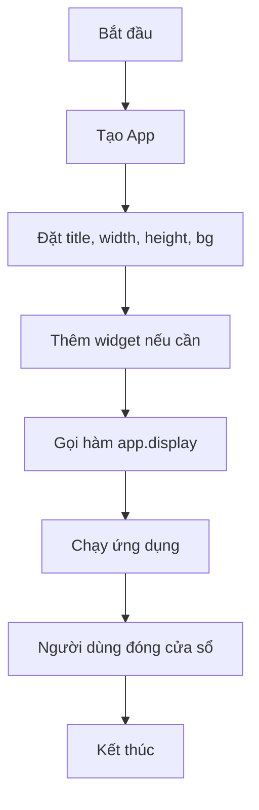
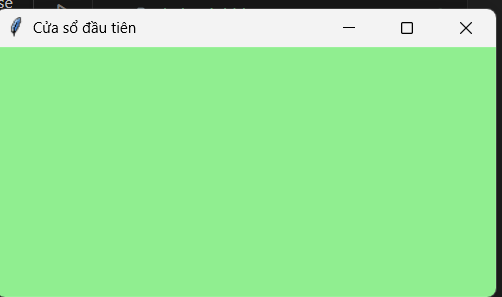

# Bài 2 - Cửa sổ cơ bản 

---

## 🎯 Mục tiêu

* Hiểu rõ đối tượng **App** trong guizero.
* Biết cách tạo một cửa sổ GUI với **tiêu đề, kích thước, màu nền**.
* Thêm text cơ bản và chạy thử chương trình.

---

## 📘 Lý thuyết

Trong guizero, **App** chính là **cửa sổ gốc**.

* Khi tạo App, bạn có thể đặt **tiêu đề**, **kích thước**, và **màu nền**.
* Một App có thể chứa nhiều **widget** (Text, Button, Picture...).
* Lệnh `app.display()` giữ cửa sổ mở và xử lý sự kiện (event loop).

Cú pháp:

```python
from guizero import App

app = App(title="Tên cửa sổ", width=400, height=300, bg="lightblue")
app.display()
```

---

## 📊 Sơ đồ (Mermaid)



---

## 💻 Ví dụ minh họa

### Ví dụ 1: Cửa sổ cơ bản

```python
from guizero import App

app = App(title="Cửa sổ đầu tiên", width=400, height=200, bg="lightgreen")
app.display()
```

### Ví dụ 2: Thêm Text vào App

```python
from guizero import App, Text

app = App(title="Xin chào GUIZERO", width=420, height=180, bg="lightyellow")
greeting = Text(app, text="Chào mừng bạn đến với guizero!", size=14, color="blue")
app.display()
```


---

## 📝 Bài tập

**Bài tập 2.1 (Cơ bản):**

* Tạo cửa sổ kích thước `600x400`, tiêu đề `"Luyện tập Bài 2"`.

**Bài tập 2.2 (Định dạng):**

* Đặt màu nền là `"lightblue"`.
* Thêm một Text `"Xin chào, tôi đang học GUIZERO"`, màu `"red"`, size 16.

**Bài tập 2.3 (Sáng tạo):**

* Tạo một cửa sổ với tiêu đề `"Hộp thoại của tôi"`.
* Chèn 2 Text: một dòng giới thiệu tên bạn, một dòng ghi `"Học GUI thật thú vị!"`.
* Thử thay đổi màu chữ từng dòng.

---

<!-- ## ✅ Gợi ý đáp án

**Bài tập 2.1**

```python
from guizero import App

app = App(title="Luyện tập Bài 2", width=600, height=400)
app.display()
```

**Bài tập 2.2**

```python
from guizero import App, Text

app = App(title="Bài tập 2.2", width=400, height=250, bg="lightblue")
msg = Text(app, text="Xin chào, tôi đang học GUIZERO", color="red", size=16)
app.display()
```

**Bài tập 2.3**

```python
from guizero import App, Text

app = App(title="Hộp thoại của tôi", width=500, height=300, bg="white")
Text(app, text="Tôi là Nguyễn Văn A", color="green", size=14)
Text(app, text="Học GUI thật thú vị!", color="purple", size=16)
app.display()
``` -->
