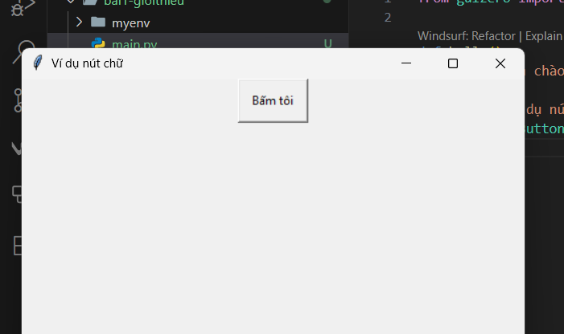
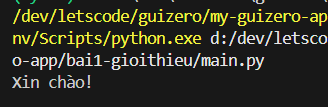
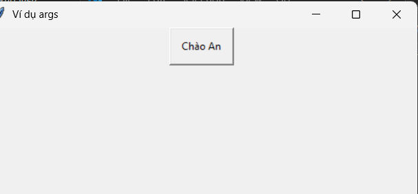
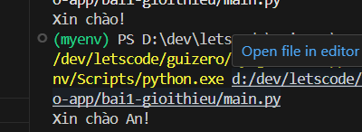
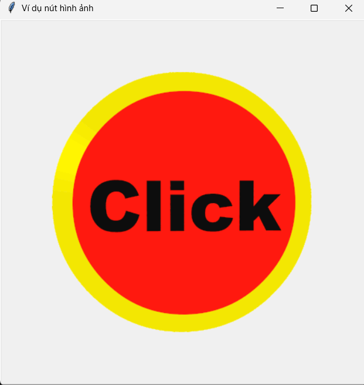
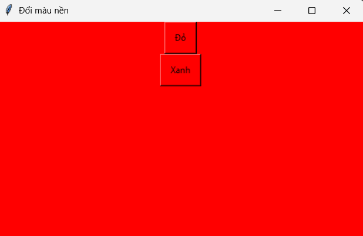
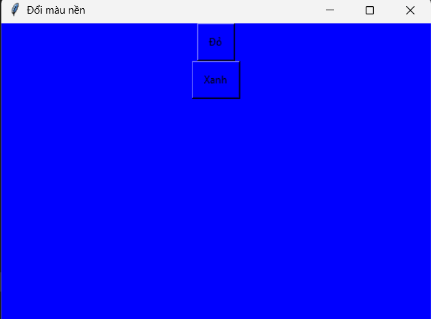
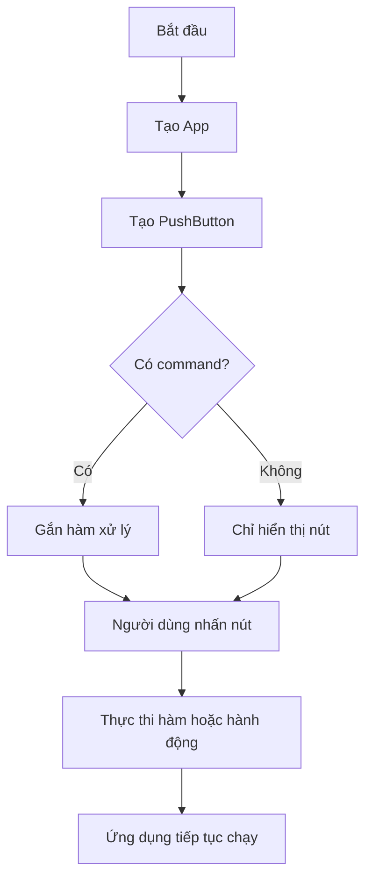

# Bài 3 - Nút Bấm

## 🎯 Mục tiêu

* Hiểu khái niệm **PushButton** trong guizero.
* Biết cách tạo một nút bấm hiển thị chữ hoặc hình ảnh.
* Biết cách gắn hàm (command) khi bấm nút.
* Tùy chỉnh các thuộc tính: màu sắc, kích thước, chữ, hình ảnh.
* Làm quen với các phương thức điều khiển PushButton.

---

## 📖 Lý thuyết

### 1. PushButton là gì?

* **PushButton** là widget (thành phần giao diện) để tạo **nút bấm** trong ứng dụng.
* Khi người dùng nhấn nút, một **hàm xử lý** (được chỉ định bằng `command`) sẽ được gọi.
* Nút có thể hiển thị **chữ** (text) hoặc **hình ảnh** (image).

---

### 2. Cách tạo PushButton

Cú pháp cơ bản:

```python
PushButton(master, command=None, args=None, text="Button", image=None, ...)
```

Trong đó:

* `master`: container chứa nút (thường là `App`, `Window` hoặc `Box`).
* `command`: tên hàm sẽ được gọi khi nhấn nút.
* `text`: chữ hiển thị trên nút (mặc định `"Button"`).
* `image`: đường dẫn ảnh hiển thị thay chữ (PNG, GIF...).
* `args`: nếu muốn truyền tham số cho `command`, dùng list.

---

### 3. Bảng thống kê tham số khởi tạo

| Tham số     | Kiểu dữ liệu            | Mặc định | Bắt buộc | Ý nghĩa                          |
| ----------- | ----------------------- | -------- | -------- | -------------------------------- |
| `master`    | App, Window, Box        | -        | ✅        | Container chứa nút               |
| `command`   | function                | None     | ❌        | Hàm gọi khi bấm                  |
| `args`      | list                    | None     | ❌        | Truyền tham số cho `command`     |
| `text`      | string                  | "Button" | ❌        | Chữ hiển thị                     |
| `image`     | string (đường dẫn ảnh)  | None     | ❌        | Ảnh thay chữ                     |
| `padx/pady` | int                     | 10       | ❌        | Khoảng cách chữ/ảnh với viền     |
| `align`     | "top/bottom/left/right" | None     | ❌        | Căn trong container              |
| `grid`      | \[x, y]                 | None     | ❌        | Vị trí khi dùng layout dạng lưới |
| `width`     | int / "fill"            | None     | ❌        | Chiều rộng                       |
| `height`    | int / "fill"            | None     | ❌        | Chiều cao                        |
| `visible`   | bool                    | True     | ❌        | Ẩn/hiện nút                      |
| `enabled`   | bool                    | None     | ❌        | Cho phép bấm hay không           |

---

### 4. Các phương thức thường dùng

| Phương thức                 | Công dụng                  |
| --------------------------- | -------------------------- |
| `after(ms, cmd)`            | Gọi hàm sau `ms` mili-giây |
| `repeat(ms, cmd)`           | Lặp gọi hàm sau mỗi `ms`   |
| `cancel(cmd)`               | Hủy lệnh đã lên lịch       |
| `enable()` / `disable()`    | Bật / tắt nút              |
| `hide()` / `show()`         | Ẩn / hiện nút              |
| `resize(w, h)`              | Đổi kích thước             |
| `update_command(cmd, args)` | Thay đổi hàm xử lý         |

---

### 5. Các thuộc tính quan trọng

| Thuộc tính    | Ý nghĩa                  |
| ------------- | ------------------------ |
| `text`        | Nội dung chữ trên nút    |
| `bg`          | Màu nền                  |
| `text_color`  | Màu chữ                  |
| `text_size`   | Kích thước chữ           |
| `text_bold`   | Chữ đậm                  |
| `text_italic` | Chữ nghiêng              |
| `visible`     | Trạng thái ẩn/hiện       |
| `enabled`     | Có bấm được không        |
| `value`       | 1 khi nhấn, 0 khi thả ra |

---

## 🛠 Ví dụ minh họa

### 1. Nút chữ cơ bản

```python
from guizero import App, PushButton

def hello():
    print("Xin chào!")

app = App("Ví dụ nút chữ")
button = PushButton(app, text="Bấm tôi", command=hello)
app.display()
```



---

### 2. Nút truyền tham số

```python
from guizero import App, PushButton

def greet(name):
    print(f"Xin chào {name}!")

app = App("Ví dụ args")
button = PushButton(app, text="Chào An", command=greet, args=["An"])
app.display()
```



---

### 3. Nút hình ảnh

```python
from guizero import App, PushButton

def clicked():
    print("Nút hình ảnh đã được bấm!")

app = App("Ví dụ nút hình ảnh")
button = PushButton(app, image="button.gif", command=clicked)
app.display()
```


---

### 4. Nút thay đổi màu nền ứng dụng

```python
from guizero import App, PushButton

def set_red():
    app.bg = "red"

def set_blue():
    app.bg = "blue"

app = App("Đổi màu nền")
btn1 = PushButton(app, text="Đỏ", command=set_red)
btn2 = PushButton(app, text="Xanh", command=set_blue)
app.display()
```




---

## 🗺 Sơ đồ Mermaid




---

## 📝 Bài tập luyện tập

1. Tạo nút `"Click me"` in ra `"Bạn vừa click!"`.
2. Làm một nút `"Exit"` để thoát ứng dụng (`app.destroy`).
3. Tạo 2 nút `"Đỏ"` và `"Xanh"` đổi màu nền app.
4. Tạo nút `"Say Hello"` truyền tham số `"Lan"`, in ra `"Xin chào Lan!"`.
5. Nâng cao: Tạo nút hình ảnh `"like.png"`, khi bấm in `"Bạn đã thích bài viết này!"`.


