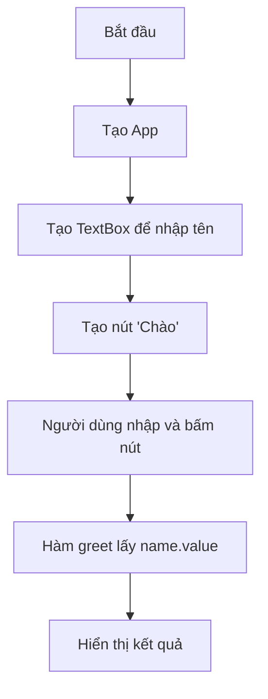

# Bài 4 - TextBox

## Mục tiêu

* Hiểu cách tạo ô nhập liệu trong guizero.
* Biết cách lấy dữ liệu từ TextBox và xử lý.

## Lý thuyết

* Widget `TextBox(app)` dùng để nhập văn bản.
* Lấy nội dung bằng `textbox.value`.
* Có thể giới hạn độ dài bằng `width`.

## Ví dụ

```python
from guizero import App, Text, TextBox, PushButton

def greet():
    output.value = "Xin chào " + name.value

app = App("Demo TextBox", width=300, height=200)

Text(app, text="Nhập tên của bạn:")
name = TextBox(app, width=20)
output = Text(app, text="")
PushButton(app, text="Chào", command=greet)

app.display()
```

## Sơ đồ Flow



## Gợi ý hình minh họa

* Một cửa sổ nhỏ có dòng chữ “Nhập tên của bạn:”
* Bên dưới là một ô nhập text.
* Có nút “Chào” ngay phía dưới.
* Khi bấm nút, xuất hiện dòng chữ “Xin chào \[tên]”.

## Bài tập

1. Tạo ứng dụng cho nhập tuổi, bấm nút sẽ hiện ra "Bạn X tuổi".
2. Làm form nhập tên và sở thích, bấm nút hiển thị câu: "Xin chào \[tên], bạn thích \[sở thích]".
3. Viết app nhập một chuỗi, bấm nút sẽ hiển thị độ dài của chuỗi đó.

