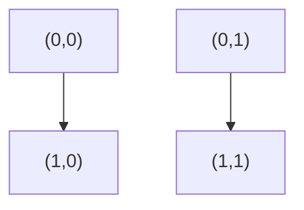
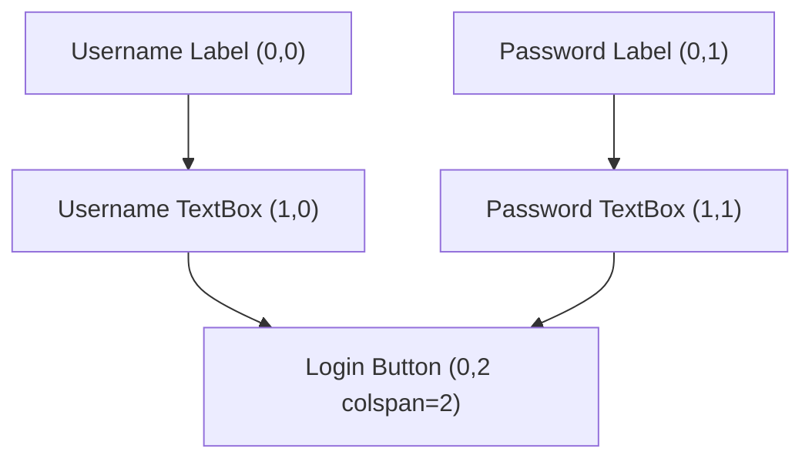

import Quiz from '@site/src/components/Quiz';

# Bài 5 - Layout Grid

---

## 1. Khái niệm

Trong guizero, khi bạn tạo một `Box(layout="grid")`, bạn đang nói với guizero rằng:

> "Tôi muốn sắp xếp các widget con theo dạng **bảng (table)**, mỗi widget nằm trong một ô (cell) xác định bởi hàng (row) và cột (column)."

👉 Grid rất hữu ích khi bạn làm form, giao diện đăng nhập, bảng điều khiển, …

---

## 2. Cú pháp `grid`

Khi thêm một widget vào `Box` có `layout="grid"`, bạn dùng tham số `grid`:

```python
widget = Widget(parent, grid=[c, r, cs, rs])
```

Trong đó:

* **c (column)** → vị trí cột (bắt đầu từ 0)
* **r (row)** → vị trí hàng (bắt đầu từ 0)
* **cs (columnspan)** → số cột chiếm (mặc định = 1)
* **rs (rowspan)** → số hàng chiếm (mặc định = 1)

---

## 3. Ví dụ cơ bản

```python
from guizero import App, Box, Text

app = App("Grid Example", width=400, height=200)

box = Box(app, layout="grid")

Text(box, text="(0,0)", grid=[0,0])
Text(box, text="(1,0)", grid=[1,0])
Text(box, text="(0,1)", grid=[0,1])
Text(box, text="(1,1)", grid=[1,1])

app.display()
```

### Minh họa sơ đồ grid:



👉 Bạn thấy bảng có 2 hàng × 2 cột.

* `(0,0)` ở hàng 0, cột 0.
* `(1,0)` ở hàng 0, cột 1.
* `(0,1)` ở hàng 1, cột 0.
* `(1,1)` ở hàng 1, cột 1.

---

## 4. Ví dụ nâng cao: Nút chiếm nhiều cột

```python
from guizero import App, Box, Text, PushButton

app = App("Grid Example", width=400, height=250)
box = Box(app, layout="grid")

Text(box, text="Username:", grid=[0,0])
Text(box, text="Password:", grid=[0,1])

# TextBox đặt ở cột 1
from guizero import TextBox
username = TextBox(box, grid=[1,0])
password = TextBox(box, grid=[1,1], hide_text=True)

# Nút chiếm 2 cột (columnspan = 2)
btn = PushButton(box, text="Login", grid=[0,2,2,1])
btn.width = "fill"

app.display()
```

### Minh họa sơ đồ grid:



---

## 5. Tính năng hay khi dùng grid

* **Columnspan (cs)**: làm widget chiếm nhiều cột → thường dùng cho nút bấm hoặc thanh tiêu đề.
* **Rowspan (rs)**: làm widget chiếm nhiều hàng → dùng cho sidebar hoặc logo.
* **width="fill" / height="fill"**: để widget giãn hết ô.

---
## 6. Câu hỏi trắc nghiệm
<Quiz
  questions={[
    {
      question: "Trong guizero, tham số grid dùng để làm gì?",
      options: [
        "Xác định vị trí widget trong bảng (row, column)",
        "Thay đổi màu nền widget",
        "Thay đổi font chữ của widget",
        "Đặt kích thước cửa sổ App"
      ],
      answer: 0
    },
    {
      question: "Trong grid=[2,1], số 2 biểu thị gì?",
      options: [
        "Row (hàng 2)",
        "Column (cột 2)",
        "Widget chiếm 2 cột",
        "Widget chiếm 2 hàng"
      ],
      answer: 1
    },
    {
      question: "Cú pháp đầy đủ của grid trong guizero có bao nhiêu tham số?",
      options: [
        "2 (c, r)",
        "3 (c, r, cs)",
        "4 (c, r, cs, rs)",
        "5 (c, r, cs, rs, align)"
      ],
      answer: 2
    },
    {
      question: "Để một widget chiếm 3 cột liên tiếp, ta dùng grid như thế nào?",
      options: [
        "grid=[0,0,3,1]",
        "grid=[3,0,0,1]",
        "grid=[0,3,1,0]",
        "grid=[1,1,1,3]"
      ],
      answer: 0
    },
    {
      question: "Tham số nào quyết định số hàng mà widget chiếm?",
      options: [
        "row",
        "rowspan",
        "column",
        "columnspan"
      ],
      answer: 1
    },
    {
      question: "Để nút Login trải ngang 2 cột, ta viết:",
      options: [
        "grid=[0,2,2,1]",
        "grid=[2,0,1,2]",
        "grid=[0,0,1,2]",
        "grid=[2,2,2,2]"
      ],
      answer: 0
    },
    {
      question: "Trong guizero, để widget lấp đầy chiều ngang trong ô, ta dùng:",
      options: [
        "widget.width = 'max'",
        "widget.width = 'full'",
        "widget.width = 'fill'",
        "widget.fill = 'width'"
      ],
      answer: 2
    },
    {
      question: "Row và Column trong grid bắt đầu đếm từ:",
      options: [
        "1",
        "0",
        "Người dùng chọn",
        "Hệ thống tự động"
      ],
      answer: 1
    },
    {
      question: "Khi không khai báo grid, widget sẽ được sắp xếp như thế nào?",
      options: [
        "Không hiển thị",
        "Theo layout mặc định (auto, dọc xuống)",
        "Theo layout ngang",
        "Theo layout chéo"
      ],
      answer: 1
    },
    {
      question: "Ứng dụng phổ biến nhất của grid trong guizero là gì?",
      options: [
        "Làm hiệu ứng animation",
        "Vẽ biểu đồ",
        "Tạo form (login, nhập liệu) gọn gàng",
        "Đổi màu App"
      ],
      answer: 2
    }
  ]}
/>
