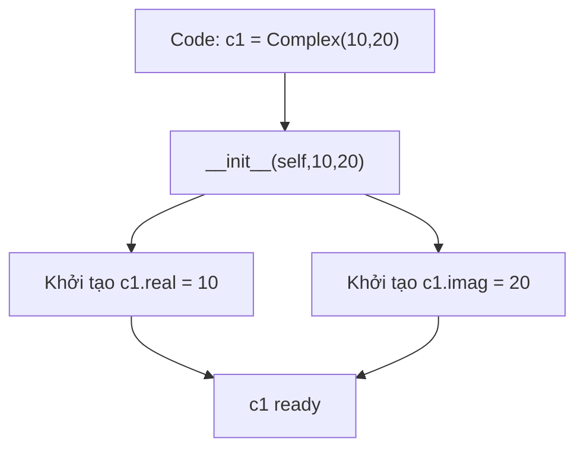
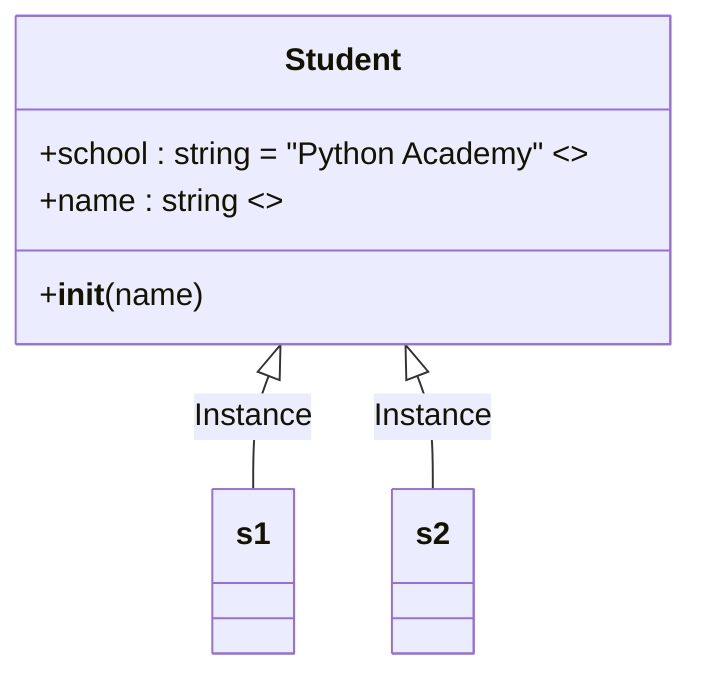

# Bài 020 - Class và Object trong Python

Trong Python, **lập trình hướng đối tượng (OOP)** là phương pháp thiết kế phần mềm dựa trên các **đối tượng** và **lớp** – một cách tiếp cận hiện đại, trực quan và dễ bảo trì. Bài viết này sẽ giúp bạn hiểu:

* Class là gì?
* Object là gì?
* Constructor và phương thức trong class
* Phân biệt Class Attribute và Instance Attribute
* Các ví dụ minh họa dễ hiểu
* Sơ đồ trực quan bằng Mermaid

---

## 1. Class và Object là gì?

### **Class (Lớp)**
Là một **khuôn mẫu (blueprint)** để tạo ra các đối tượng. Class định nghĩa các thuộc tính (dữ liệu) và phương thức (hành vi) mà các đối tượng sẽ có.

### **Object (Đối tượng)**
Là một **thực thể cụ thể** được tạo ra từ class. Mỗi object có dữ liệu riêng (instance attribute) nhưng có thể dùng chung một số thuộc tính hoặc phương thức của class.

---

## 2. Sơ đồ minh họa Class và Object

```mermaid
flowchart TD
    A([Class: Complex]) -->|Tạo object| B([Object c1])
    A -->|Tạo object| C([Object c2])
    B -->|Có thuộc tính riêng| D[real=10, imag=20]
    C -->|Có thuộc tính riêng| E[real=5, imag=5]
````

---

## 3. Ví dụ cơ bản về Class và Object

```python
class Complex:
    def __init__(self, real, imag):
        self.real = real
        self.imag = imag

    def print(self):
        print(f"{self.real}+{self.imag}i")

    def add(self, other):
        self.real += other.real
        self.imag += other.imag

# Tạo đối tượng
c1 = Complex(10, 20)
c2 = Complex(5, 5)

c1.print()      # 👉 10+20i
c1.add(c2)
c1.print()      # 👉 15+25i
```

---

## 4. Constructor và phương thức

* `__init__`: là **constructor**, dùng để khởi tạo giá trị ban đầu cho object.
* `self`: đại diện cho đối tượng hiện tại.
* `c1`, `c2`: là các **instance** (đối tượng) của class `Complex`.

### Sơ đồ Constructor hoạt động



---

## 5. Class Attribute vs Instance Attribute

* **Class Attribute**: Thuộc tính chung cho tất cả object (được định nghĩa trong class, ngoài `__init__`).
* **Instance Attribute**: Thuộc tính riêng cho từng object (thường được tạo trong `__init__`).

### Ví dụ

```python
class Student:
    school = "Python Academy"   # Class Attribute

    def __init__(self, name):
        self.name = name        # Instance Attribute

s1 = Student("Alice")
s2 = Student("Bob")

print(s1.school, s1.name)  # 👉 Python Academy Alice
print(s2.school, s2.name)  # 👉 Python Academy Bob
```

### Sơ đồ Class vs Instance Attribute



---

## 6. Kết luận

* **Class**: định nghĩa cấu trúc và hành vi.
* **Object**: thực thể cụ thể từ class, có dữ liệu riêng.
* **Constructor** (`__init__`): khởi tạo object.
* **Class Attribute**: dùng chung.
* **Instance Attribute**: riêng biệt cho từng object.


