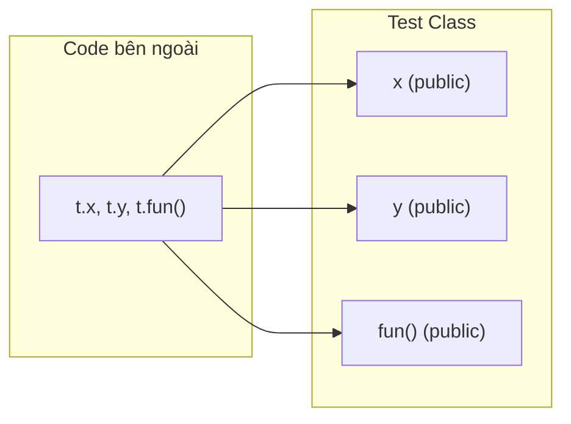
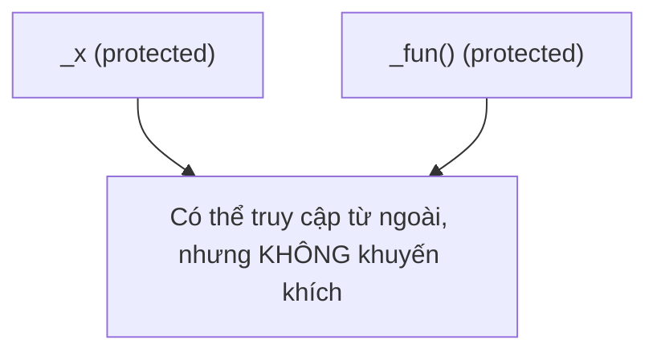
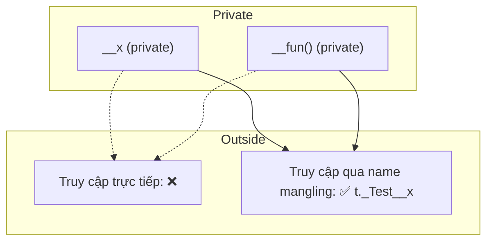
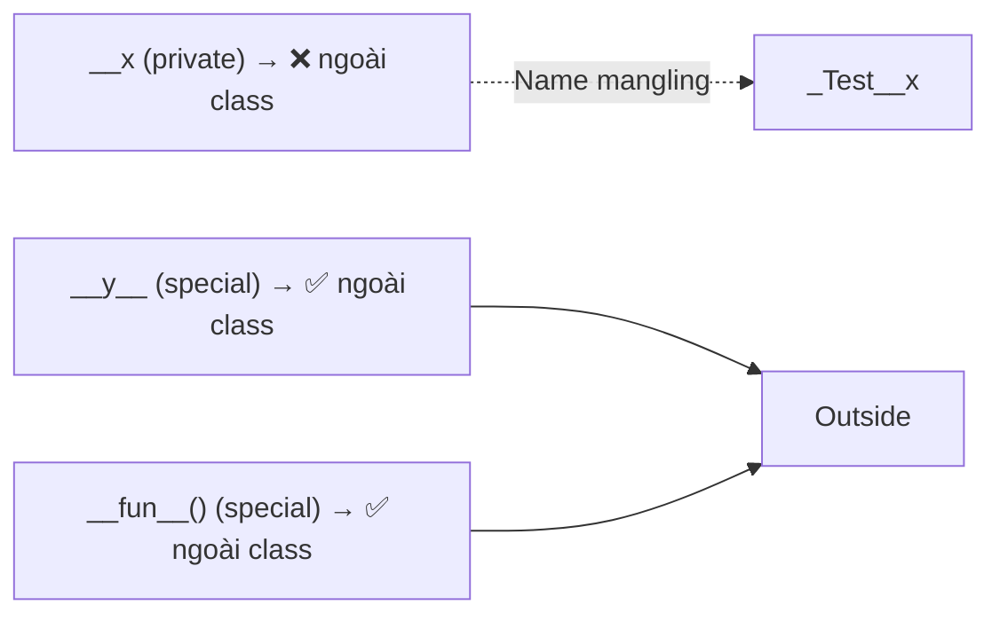
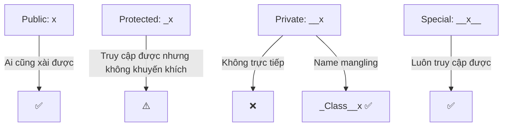

# Bài 022 – Encapsulation trong Python OOP

**Encapsulation** (đóng gói) là nguyên lý quan trọng trong OOP, nhằm **ẩn giấu thông tin bên trong lớp** và chỉ cho phép truy cập những gì cần thiết.  
👉 Giúp **bảo vệ trạng thái nội bộ** và tránh thay đổi không mong muốn.

---

## 1. Thành viên công khai (Public Members)

Mặc định, tất cả biến & phương thức trong lớp là **public**, có thể truy cập ở mọi nơi.

```python
class Test:
    def __init__(self, x, y):
        self.x = x
        self.y = y

    def fun(self):
        print("Hi")

t = Test(10, 20)
print(t.x)
print(t.y)
t.fun()
````

✅ Truy cập được trực tiếp.



---

## 2. Thành viên được bảo vệ (Protected Members)

Dùng dấu gạch dưới đơn `_`.
👉 Theo quy ước, chỉ nên dùng trong **class** và **subclass**, nhưng vẫn **truy cập được từ bên ngoài**.

```python
class Test:
    def __init__(self, x, y):
        self._x = x
        self.y = y

    def _fun(self):
        print("Hi")

t = Test(10, 20)
print(t._x)    # vẫn truy cập được
t._fun()       # vẫn gọi được
```



---

## 3. Thành viên riêng tư (Private Members)

Dùng **2 dấu gạch dưới `__`**.
Python sẽ áp dụng **name mangling** → đổi tên thành `_ClassName__attr`.

```python
class Test:
    def __init__(self, x, y):
        self.__x = x
        self.y = y

    def __fun(self):
        print("Hi")

t = Test(10, 20)
print(t.__x)   # ❌ Lỗi
t.__fun()      # ❌ Lỗi

# ✅ Truy cập gián tiếp
print(t._Test__x)
t._Test__fun()
```



---

## 4. Truy cập private bên trong lớp

```python
class Test:
    def __init__(self, x):
        self.x = x
        self.__y = 10

    def printTest(self):
        print(self.x)
        print(self.__y)

t = Test(5)
t.printTest()   # ✅ truy cập được __y
```

👉 Private chỉ bị hạn chế **bên ngoài**, còn trong class thì vẫn OK.

---

## 5. Trường hợp đặc biệt: `__x__`

Tên có 2 dấu gạch dưới ở **đầu và cuối** → **special methods** (dunder methods).
👉 Không bị đổi tên, Python định nghĩa sẵn.

```python
class Test:
    def __init__(self, x):
        self.__x = x
        self.__y__ = 20

    def __fun__(self):
        print("Hi")

t = Test(10)
print(t.__y__)     # ✅ truy cập được
t.__fun__()        # ✅ gọi được
```



---

## 📊 Tóm tắt mức độ truy cập

| Kiểu đặt tên | Mức truy cập       | Truy cập từ ngoài | Bị đổi tên? |
| ------------ | ------------------ | ----------------- | ----------- |
| `x`          | Public (công khai) | ✅                 | ❌           |
| `_x`         | Protected (bảo vệ) | ✅ (nên hạn chế)   | ❌           |
| `__x`        | Private (riêng tư) | ❌ trực tiếp       | ✅           |
| `__x__`      | Special (đặc biệt) | ✅                 | ❌           |



---

## 🎯 Kết luận

Encapsulation giúp:

* Kiểm soát quyền truy cập.
* Bảo vệ dữ liệu.
* Làm code rõ ràng, dễ bảo trì.

👉 Python không ép buộc quá chặt, nhưng tuân theo quy ước là best practice.

