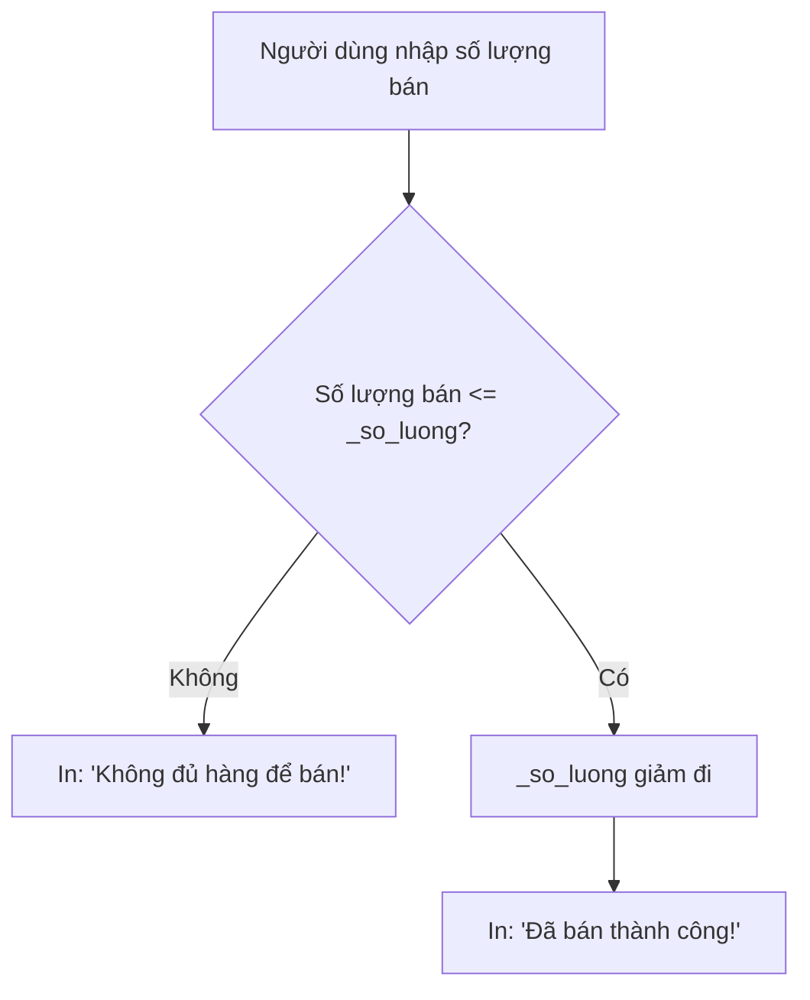
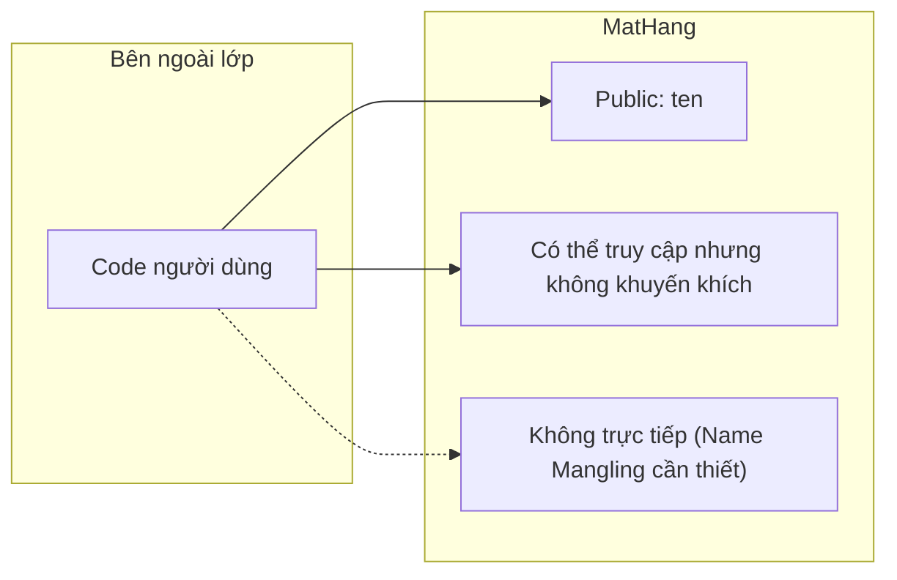
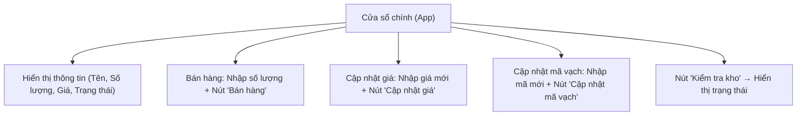

# Bài tập: Thiết kế lớp `MatHang` & Giao diện Quản Lý Bằng `guizero`

## 🎯 Mục tiêu
- Ôn lại kiến thức **Encapsulation** (đóng gói dữ liệu).  
- Thực hành viết **class trong Python** với public / protected / private.  
- Ứng dụng lớp vào GUI bằng thư viện **guizero**.  

---

## 1️⃣ Thiết kế lớp `MatHang`

### Thuộc tính

| Tên thuộc tính | Kiểu truy cập | Ý nghĩa |
| -------------- | ------------- | ------- |
| `ten`          | Public        | Tên mặt hàng |
| `_so_luong`    | Protected     | Số lượng trong kho |
| `__gia`        | Private       | Giá bán mỗi đơn vị |
| `__ma_vach`    | Private       | Mã vạch sản phẩm |

```mermaid
classDiagram
    class MatHang {
        +ten
        #_so_luong
        -__gia
        -__ma_vach
        +hien_thi_thong_tin()
        +hien_thi_so_luong()
        +lay_gia()
        +cap_nhat_gia(gia_moi)
        +kiem_tra_kho()
        +cap_nhat_ma_vach(ma_moi)
        +lay_ma_vach()
        +ban(so_luong_ban)
        +__str__()
    }
````

---

### Phương thức chính

* `hien_thi_thong_tin()` → in tên mặt hàng.
* `hien_thi_so_luong()` → in số lượng.
* `lay_gia()` → lấy giá bán.
* `cap_nhat_gia(gia_moi)` → cập nhật giá (nếu hợp lệ).
* `kiem_tra_kho()` → trả về `"Hàng nhiều"`, `"Hàng ổn định"`, `"Sắp hết hàng"`.
* `ban(so_luong_ban)` → xử lý bán hàng.
* `cap_nhat_ma_vach(ma_moi)` → cập nhật mã vạch (chỉ 8 hoặc 12 ký tự).
* `__str__()` → hiển thị thông tin mặt hàng.

---

### Luồng xử lý: Cập nhật giá

```mermaid
flowchart TD
    A["Nhập giá mới"] --> B{"Giá > 0?"}
    B -- Không --> C["In: 'Giá không hợp lệ!'"]
    B -- Có --> D["Cập nhật __gia"]
    D --> E["Thông báo thành công"]
```

---

### Luồng xử lý: Bán hàng



---

### Minh họa Encapsulation trong lớp



---

## 2️⃣ Bài tập GUI với `guizero`

Ứng dụng GUI sẽ cho phép:

* Xem thông tin mặt hàng.
* Bán hàng.
* Cập nhật giá.
* Cập nhật mã vạch.
* Kiểm tra kho.

---

### Sơ đồ tổng quan giao diện



---

### Gợi ý code khung GUI

```python
from guizero import App, Text, TextBox, PushButton

# Khởi tạo app
app = App("Quản Lý Mặt Hàng", width=400, height=400)

# Các widget hiển thị thông tin
Text(app, "Tên mặt hàng: Gạo thơm")
Text(app, "Số lượng: 120")
Text(app, "Giá: 15000")
Text(app, "Trạng thái kho: Hàng nhiều")

# TextBox nhập liệu + nút
Text(app, "Nhập số lượng bán:")
so_luong_ban = TextBox(app)
PushButton(app, text="Bán hàng", command=lambda: print("Xử lý bán"))

# Cập nhật giá
Text(app, "Nhập giá mới:")
gia_moi = TextBox(app)
PushButton(app, text="Cập nhật giá", command=lambda: print("Cập nhật giá"))

# Cập nhật mã vạch
Text(app, "Nhập mã vạch mới:")
ma_vach = TextBox(app)
PushButton(app, text="Cập nhật mã vạch", command=lambda: print("Cập nhật mã"))

# Kiểm tra kho
PushButton(app, text="Kiểm tra kho", command=lambda: print("Kiểm tra kho"))

app.display()
```

---

## 📌 Tổng kết

* Bài tập giúp luyện cả **Encapsulation (public / protected / private)**.
* Biết cách dùng **name mangling** để truy cập private khi cần.
* Thực hành xây dựng **ứng dụng GUI** để quản lý mặt hàng trong thực tế.

