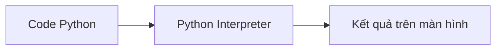

# Bài 01: Làm quen với Python

## Khung học vui

**Bối cảnh:** Bạn là người phụ trách mở màn CLB công nghệ của lớp. Nhiệm vụ là viết vài dòng Python khiến máy tính chào từng bạn, giới thiệu lớp học, rồi in ra một lời nhắc vui cho buổi học.

**Thử ngay trong 5 phút:** Đổi nội dung trong `print()` thành câu chào theo tên của bạn, tên lớp, và một mục tiêu học Python trong tuần này.

**Hoạt động cặp đôi:** Một bạn nghĩ ra câu nói, một bạn biến câu nói đó thành `print()`. Sau 3 phút đổi vai.

**Nâng cấp sau giờ học:** Tạo file `hello_club.py` in ra 5 dòng: tên CLB, tên bạn, môn yêu thích, lý do học Python, và một câu động viên.

> Gợi ý học nhanh: chạy code sớm, sửa từng lỗi nhỏ, đổi dữ liệu đầu vào ít nhất 3 lần. Đây là cách biến cú pháp khô thành trải nghiệm có phản hồi ngay.

---


## 1. Mục tiêu bài học

Sau buổi học này, học sinh có thể:

* Hiểu Python là gì và vì sao Python phù hợp cho người mới học lập trình.
* Biết Python được dùng trong những lĩnh vực nào.
* Phân biệt đơn giản giữa ngôn ngữ biên dịch và ngôn ngữ thông dịch.
* Cài đặt Python và Visual Studio Code.
* Tạo file Python đầu tiên.
* Viết và chạy chương trình đầu tiên bằng lệnh `print()`.

---

## 2. Khởi động: Lập trình là gì?

Trước khi học Python, chúng ta cần hiểu lập trình là gì.

Lập trình là cách con người viết hướng dẫn cho máy tính thực hiện một công việc nào đó.

Ví dụ, nếu muốn máy tính hiển thị một câu chào, ta có thể viết:

```python
print("Xin chào!")
```

Khi chạy chương trình, máy tính sẽ hiển thị:

```text
Xin chào!
```

Máy tính không tự hiểu ý muốn của con người. Vì vậy, lập trình giúp ta biến ý tưởng thành các bước rõ ràng để máy tính làm theo.

Một chương trình có thể rất đơn giản, ví dụ in ra một dòng chữ. Nhưng cũng có thể rất lớn, ví dụ một trò chơi, một website, một ứng dụng đặt xe, hoặc một hệ thống trí tuệ nhân tạo.

---

## 3. Python là gì?


Python là một ngôn ngữ lập trình phổ biến, dễ đọc và dễ tiếp cận với người mới bắt đầu.

Python được tạo ra bởi Guido van Rossum và ra mắt lần đầu vào năm 1991. Tên gọi “Python” được lấy cảm hứng từ chương trình hài “Monty Python’s Flying Circus”, không phải từ loài rắn Python.

Python được nhiều trường học, lập trình viên và công ty sử dụng vì cú pháp của nó khá gần với ngôn ngữ tự nhiên.

Ví dụ:

```python
print("Tôi đang học Python")
```

Dòng lệnh này khá dễ đoán ý nghĩa:

| Thành phần              | Ý nghĩa                      |
| ----------------------- | ---------------------------- |
| `print`                 | In nội dung ra màn hình      |
| `"Tôi đang học Python"` | Nội dung muốn hiển thị       |
| `()`                    | Nơi đặt dữ liệu đưa vào lệnh |

---

## 4. Python được dùng để làm gì?


Python là ngôn ngữ đa mục đích. Điều đó có nghĩa là Python không chỉ dùng cho một việc duy nhất, mà có thể dùng trong nhiều lĩnh vực khác nhau.

| Lĩnh vực         | Python có thể làm gì?            | Ví dụ gần gũi                                  |
| ---------------- | -------------------------------- | ---------------------------------------------- |
| Tự động hóa      | Làm các công việc lặp đi lặp lại | Đổi tên nhiều file, xử lý bảng điểm            |
| Web              | Tạo website và hệ thống quản lý  | Website học tập, trang đăng ký khóa học        |
| Dữ liệu          | Phân tích và vẽ biểu đồ          | Tính điểm trung bình, thống kê kết quả         |
| Trí tuệ nhân tạo | Xử lý văn bản, hình ảnh, dự đoán | Chatbot, nhận diện khuôn mặt                   |
| Game             | Làm trò chơi đơn giản            | Game đoán số, rắn săn mồi, vẽ hình bằng Turtle |

Trong khóa học này, chúng ta sẽ bắt đầu từ những chương trình nhỏ, dễ hiểu. Sau đó, học sinh sẽ dần sử dụng Python để tạo trò chơi, giải bài toán và xây dựng sản phẩm đơn giản.

---

## 5. Vì sao nên học Python trước?

Khi mới học lập trình, điều khó nhất không phải là nhớ thật nhiều lệnh. Điều khó hơn là học cách suy nghĩ rõ ràng.

Ví dụ, để giải một bài toán, ta cần biết:

1. Bài toán yêu cầu gì?
2. Dữ liệu đầu vào là gì?
3. Cần xử lý theo những bước nào?
4. Kết quả cuối cùng là gì?

Python giúp người mới tập trung vào tư duy này vì cú pháp của Python đơn giản hơn nhiều ngôn ngữ khác.

Ví dụ, để hiển thị một câu ra màn hình:

```python
print("Mình thích học lập trình")
```

Chỉ với một dòng lệnh, học sinh đã có thể thấy kết quả ngay. Điều này giúp quá trình học bớt khô khan và dễ thử nghiệm hơn.

---

## 6. Máy tính chạy chương trình như thế nào?


Con người viết code bằng ngôn ngữ lập trình như Python. Nhưng máy tính không hiểu trực tiếp ngôn ngữ của con người.

Vì vậy, cần có một công cụ giúp chuyển code thành dạng máy tính có thể thực hiện.

Có hai cách phổ biến để chạy chương trình:

* Biên dịch
* Thông dịch

---

## 7. Ngôn ngữ biên dịch

Với ngôn ngữ biên dịch, chương trình thường được chuyển thành dạng máy tính có thể chạy trước khi thực thi.

Có thể hiểu đơn giản:

> Biên dịch giống như dịch toàn bộ một quyển sách sang ngôn ngữ khác trước, sau đó mới đọc.

Một số ngôn ngữ thường được nhắc đến khi nói về biên dịch:

* C
* C++
* Go
* Rust

Ưu điểm thường gặp:

* Chương trình có thể chạy nhanh.
* Phù hợp với phần mềm cần hiệu năng cao.

Nhược điểm với người mới:

* Quy trình ban đầu có thể phức tạp hơn.
* Khi gặp lỗi, học sinh có thể khó hiểu lỗi đến từ đâu.

---

## 8. Ngôn ngữ thông dịch

Với ngôn ngữ thông dịch, chương trình thường được chạy thông qua một trình thông dịch.

Có thể hiểu đơn giản:

> Thông dịch giống như có một người phiên dịch đứng cạnh, ta nói từng câu và người đó dịch ngay.

Python thường được xếp vào nhóm ngôn ngữ thông dịch. Điều này giúp người học có thể viết code, chạy thử, sửa lỗi và chạy lại rất nhanh.

Ví dụ:

```python
print("Python rất dễ bắt đầu")
```

Ta có thể chạy ngay dòng code này và thấy kết quả lập tức.

Lưu ý: Khi học sâu hơn, ta sẽ biết Python cũng có những bước xử lý bên trong như tạo bytecode. Nhưng ở buổi đầu, chỉ cần hiểu rằng Python cho phép viết và chạy thử chương trình rất nhanh.

---

## 9. Sơ đồ đơn giản

Thay vì dùng ảnh phức tạp, ta dùng sơ đồ đơn giản sau:

```text
Code Python  →  Python Interpreter  →  Kết quả trên màn hình
```

Nếu tài liệu hỗ trợ Mermaid, có thể dùng:



---

## 10. Công cụ cần cài đặt

Để học Python, chúng ta cần hai công cụ chính:

| Công cụ            | Vai trò                                       |
| ------------------ | --------------------------------------------- |
| Python             | Giúp máy tính chạy được chương trình Python   |
| Visual Studio Code | Nơi viết, quản lý và chạy code thuận tiện hơn |

---

## 11. Cài đặt Python


### Bước 1: Truy cập trang tải Python

Vào trang:

```text
https://www.python.org/downloads/
```

Tải phiên bản Python phù hợp với hệ điều hành.

### Bước 2: Cài đặt Python

Khi cài trên Windows, cần chọn:

```text
Add Python to PATH
```

Đây là bước rất quan trọng. Nếu không chọn, máy tính có thể không nhận lệnh `python` trong Terminal.

### Bước 3: Kiểm tra cài đặt

Sau khi cài xong, mở Command Prompt hoặc Terminal và gõ:

```bash
python --version
```

Nếu thấy kết quả tương tự như sau, nghĩa là Python đã được cài thành công:

```text
Python 3.x.x
```

---

## 12. Cài đặt Visual Studio Code


### Bước 1: Tải VS Code

Vào trang:

```text
https://code.visualstudio.com/
```

Tải và cài đặt Visual Studio Code.

### Bước 2: Mở VS Code

Sau khi cài đặt, mở VS Code. Đây sẽ là công cụ chính để viết code trong khóa học.

---

## 13. Cài Python Extension trong VS Code


Python Extension giúp VS Code hỗ trợ Python tốt hơn.

Các bước thực hiện:

1. Mở VS Code.
2. Chọn biểu tượng Extensions ở thanh bên trái.
3. Tìm:

```text
Python
```

4. Chọn extension Python của Microsoft.
5. Bấm Install.

Sau khi cài đặt, VS Code có thể hỗ trợ:

* Gợi ý code.
* Nhận diện lỗi cơ bản.
* Chạy file Python.
* Hỗ trợ debug khi học nâng cao.

---

## 14. Tạo chương trình Python đầu tiên


### Bước 1: Tạo thư mục học tập

Tạo một thư mục mới, ví dụ:

```text
python-buoi-01
```

Sau đó mở thư mục này bằng VS Code.

### Bước 2: Tạo file Python

Trong VS Code, tạo file mới tên:

```text
hello.py
```

File Python thường có đuôi là `.py`.

### Bước 3: Viết code đầu tiên

Trong file `hello.py`, viết:

```python
print("Xin chào thế giới!")
```

### Bước 4: Chạy chương trình

Mở Terminal trong VS Code:

```text
Terminal > New Terminal
```

Sau đó gõ:

```bash
python hello.py
```

Nếu màn hình hiển thị:

```text
Xin chào thế giới!
```

nghĩa là chương trình đầu tiên đã chạy thành công.

---

## 15. Hiểu dòng code đầu tiên

Dòng code:

```python
print("Xin chào thế giới!")
```

có thể hiểu như sau:

| Thành phần             | Ý nghĩa                              |
| ---------------------- | ------------------------------------ |
| `print`                | Lệnh hiển thị nội dung ra màn hình   |
| `()`                   | Nơi đặt dữ liệu truyền vào lệnh      |
| `"Xin chào thế giới!"` | Chuỗi văn bản muốn hiển thị          |
| Dấu ngoặc kép `"`      | Dùng để đánh dấu nội dung là văn bản |

Nếu viết sai cú pháp, Python sẽ báo lỗi.

Ví dụ sai:

```python
print(Xin chào thế giới!)
```

Ví dụ đúng:

```python
print("Xin chào thế giới!")
```

---

## 16. Chạy nhiều dòng lệnh

Python sẽ chạy chương trình theo thứ tự từ trên xuống dưới.

Ví dụ:

```python
print("Xin chào, mình là An.")
print("Hôm nay mình bắt đầu học Python.")
print("Mục tiêu của mình là tạo được một game đơn giản.")
```

Kết quả:

```text
Xin chào, mình là An.
Hôm nay mình bắt đầu học Python.
Mục tiêu của mình là tạo được một game đơn giản.
```

Qua ví dụ này, ta thấy chương trình chạy từng dòng theo đúng thứ tự đã viết.

---

## 17. Hoạt động trên lớp


### Hoạt động 1: Chương trình giới thiệu bản thân

Tạo file:

```text
about_me.py
```

Viết chương trình in ra 3 dòng:

* Tên của em.
* Lý do em muốn học Python.
* Một sản phẩm em muốn tự làm sau khóa học.

Ví dụ:

```python
print("Tên của em là Minh.")
print("Em muốn học Python để làm game.")
print("Sau khóa học, em muốn làm một trò chơi đoán số.")
```

---

### Hoạt động 2: Thử thay đổi nội dung

Sửa chương trình trên thành thông tin của chính em.

Ví dụ:

```python
print("Tên của em là Linh.")
print("Em thích máy tính và trò chơi.")
print("Em muốn tự làm một game nhỏ bằng Python.")
```

Sau đó chạy lại chương trình.

Câu hỏi thảo luận:

* Khi thay đổi nội dung trong dấu ngoặc kép, kết quả có thay đổi không?
* Nếu đổi thứ tự các dòng `print`, kết quả có thay đổi không?
* Python chạy dòng nào trước?

---

### Hoạt động 3: Sửa lỗi nhanh

Giáo viên đưa đoạn code sau:

```python
print("Xin chào Python"
```

Câu hỏi:

* Chương trình sai ở đâu?
* Cần sửa lại như thế nào?

Đáp án:

```python
print("Xin chào Python")
```

Lỗi nằm ở việc thiếu dấu ngoặc tròn đóng `)`.

---

## Tự luyện tại lớp

### Bài 1: Giới thiệu bản thân

Tạo file:

```text
about_me.py
```

Viết chương trình in ra ít nhất 5 dòng giới thiệu bản thân.

Gợi ý:

```python
print("Tên của em là ...")
print("Em học lớp ...")
print("Sở thích của em là ...")
print("Môn học em thích là ...")
print("Em muốn dùng Python để ...")
```

---

### Bài 2: Kế hoạch học Python

Tạo file:

```text
my_plan.py
```

Viết chương trình in ra 3 mục tiêu em muốn đạt được sau khi học Python.

Ví dụ:

```python
print("Mục tiêu 1: Hiểu cách viết chương trình đơn giản.")
print("Mục tiêu 2: Làm được game nhỏ.")
print("Mục tiêu 3: Biết cách sửa lỗi khi code sai.")
```

---

### Bài 3: Sửa lỗi

Đoạn code sau bị sai. Hãy sửa lại cho đúng.

```python
print("Em đang học Python)
print(Hôm nay là buổi học đầu tiên")
print("Em sẽ cố gắng luyện tập mỗi ngày"
```

Gợi ý:

* Kiểm tra dấu ngoặc kép.
* Kiểm tra dấu ngoặc tròn.
* Mỗi lệnh `print()` cần viết đầy đủ.

---

## 19. Tổng kết bài học

Trong bài học này, chúng ta đã biết:

* Lập trình là cách viết hướng dẫn cho máy tính.
* Python là ngôn ngữ lập trình dễ học, phổ biến và phù hợp cho người mới.
* Python có thể dùng để làm web, xử lý dữ liệu, tự động hóa, AI và game.
* Python thường được xem là ngôn ngữ thông dịch.
* VS Code là công cụ giúp viết code thuận tiện hơn.
* File Python có đuôi `.py`.
* Lệnh `print()` dùng để hiển thị nội dung ra màn hình.

Câu lệnh quan trọng nhất của buổi học:

```python
print("Mình đã bắt đầu học lập trình!")
```
---

## Tự luyện tại lớp: nâng cấp bài vừa học

Các bài dưới đây dùng để luyện ngay trong lớp. Không cần làm giống hệt ví dụ trong bài giảng; hãy đổi bối cảnh, đổi dữ liệu và thêm một luật nhỏ của riêng bạn.

1. Chạy lại ví dụ chính, sau đó thay dữ liệu bằng tình huống trong lớp của bạn.
2. Thêm ít nhất một `input()` để chương trình nhận dữ liệu từ người dùng.
3. In kết quả thành câu hoàn chỉnh, dễ hiểu với người chưa biết code.
4. Thử một trường hợp dễ sai và ghi lại chương trình xử lý ra sao.
5. Nâng cấp thêm một luật mới: giảm giá, giới hạn lượt, xếp loại, lọc dữ liệu hoặc cảnh báo lỗi.

**Mức đạt:** chương trình chạy được, có 3 bộ dữ liệu thử, tên biến rõ nghĩa và bạn giải thích được input, xử lý, output bằng lời của mình.
