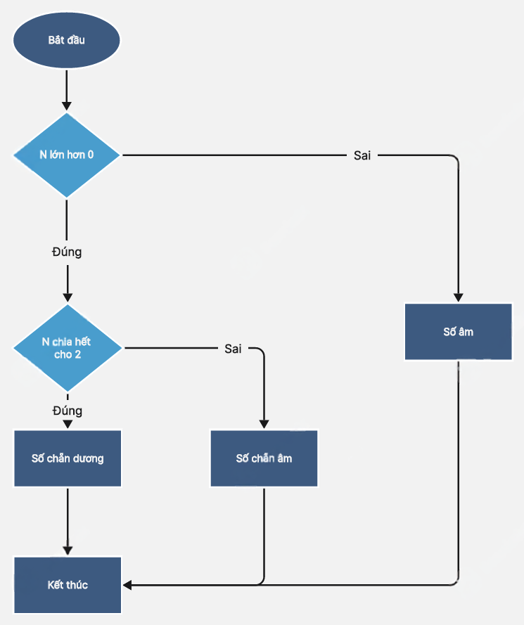

# Bài 4-2: Lưu đồ thuật toán với if else

## 1. **Lưu đồ thuật toán là gì?**

Lưu đồ thuật toán (flowchart) là **biểu đồ trực quan** mô tả trình tự thực hiện các bước trong một thuật toán. Trong lập trình, lưu đồ giúp học sinh dễ hiểu logic của chương trình trước khi viết mã nguồn.

## 2. **Biểu tượng trong lưu đồ**


---

## 3. **Lưu đồ cho câu lệnh `if - else`**

Câu lệnh `if - else` thường được biểu diễn bằng **hình thoi** rẽ nhánh thành **2 hướng: Đúng và Sai**.

### Ví dụ 1: Kiểm tra số chẵn hay lẻ

Giả sử ta cần viết chương trình kiểm tra một số nguyên `n` là **chẵn hay lẻ**:

```python
if n % 2 == 0:
    print("Even")
else:
    print("Odd")
```

### Lưu đồ minh họa:


## 4. **Lưu đồ nhiều điều kiện với `if - elif - else`**

Khi cần kiểm tra **nhiều trường hợp**, ta dùng `if - elif - else`.

### Ví dụ: Phân loại điểm số

```python
if score >= 8:
    print("Giỏi")
elif score >= 6.5:
    print("Khá")
elif score >= 5:
    print("Trung bình")
else:
    print("Yếu")
```

### Lưu đồ minh họa:

* Mỗi nhánh `elif` là một hình thoi mới nối tiếp nhánh sai của điều kiện trước.
* Có thể biểu diễn bằng **nhiều tầng hình thoi** nối tiếp nhau.

---

## 5. **Lưu đồ lồng nhau (`nested if`)**

Khi đặt một câu lệnh `if` bên trong một `if` khác, ta cần vẽ lưu đồ lồng 2 điều kiện lại với nhau.

### Ví dụ:

```python
if n >= 0:
    if n % 2 == 0:
        print("Số chẵn dương")
    else:
        print("Số lẻ dương")
else:
    print("Số âm")
```

### Lưu đồ:



## 6. **Tóm tắt cách vẽ lưu đồ điều kiện**


---

## 7. **Tự luyện**

Hãy chọn một trong các bài sau và **vẽ lưu đồ bằng tay hoặc phần mềm**:


---

### **Bài tập 1 (mới): Máy bán nước tự động**

**Mô tả:**
Giả sử bạn đang lập trình cho một **máy bán nước tự động**. Khi người dùng chọn một mã đồ uống và nhập số tiền, máy sẽ xử lý:

* Nếu tiền đủ → in ra loại nước đã chọn và tiền thừa (nếu có)
* Nếu tiền thiếu → in thông báo "Bạn chưa đủ tiền, vui lòng thêm"
* Nếu mã không hợp lệ → in "Mã không hợp lệ"

**Danh sách đồ uống ví dụ:**

* `1`: Nước suối – 10.000
* `2`: Sữa tươi – 15.000
* `3`: Trà chanh – 12.000

**Yêu cầu nhóm:**

* Bạn 1: Thiết kế sơ đồ khối cho quá trình chọn đồ → nhập tiền → xử lý → xuất kết quả.
* Bạn 2: Viết chương trình Python xử lý theo logic trên.
* Bạn 3: Kiểm thử với nhiều trường hợp: tiền đủ, tiền thiếu, mã sai – rồi ghi lại kết quả.

**Gợi ý mở rộng:**
Cho phép người dùng tiếp tục chọn đồ uống khác sau mỗi lần mua.

---

### **Bài tập 2 (giữ nguyên): Trợ lý tư vấn thời tiết và trang phục**

**Mô tả:**
Viết chương trình nhập nhiệt độ ngoài trời, từ đó đưa ra lời khuyên về thời tiết và trang phục:

* Dưới 18 độ → "Trời lạnh. Hãy mặc áo ấm."
* Từ 18 đến dưới 30 độ → "Trời mát. Mặc đồ bình thường."
* Từ 30 trở lên → "Trời nóng. Uống nhiều nước và mặc đồ mát."

**Yêu cầu nhóm:**

* Bạn 1: Thiết kế sơ đồ khối từng bước.
* Bạn 2: Viết mã Python tương ứng.
* Bạn 3: Kiểm thử và trình bày báo cáo kết quả.


---

