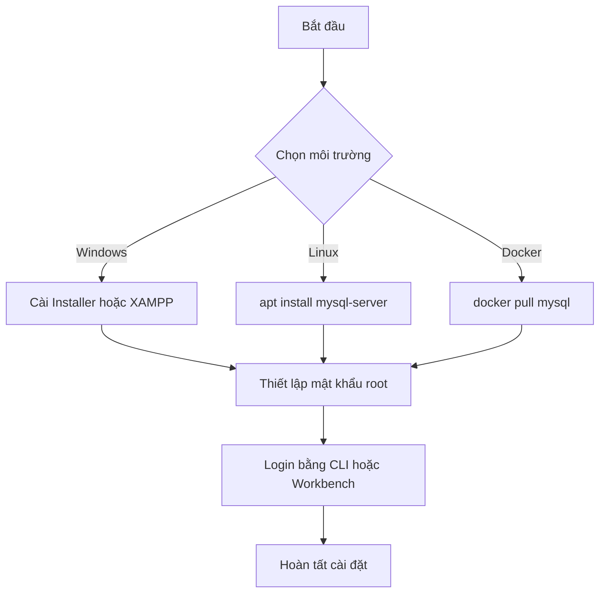
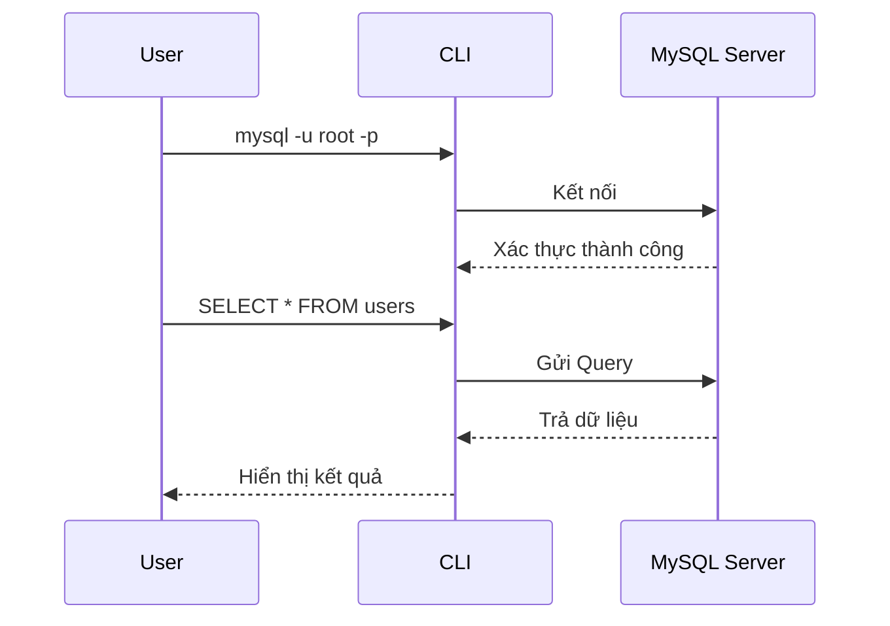

import Quiz from '@site/src/components/Quiz';

# Bài 2 - Cài đặt MySQL và MySQL Workbench

## 🎓 **CHƯƠNG 1 – Bài 2: Cài đặt MySQL + MySQL Workbench & MySQL CLI**
---

## 🎯 Mục tiêu học tập

* Biết cách cài MySQL trên **Windows, Linux, XAMPP, Docker**.
* Biết dùng **MySQL CLI** (dòng lệnh) và **MySQL Workbench** (giao diện).
* Thực hiện được các thao tác cơ bản: login, tạo database, chạy lệnh SQL đầu tiên.

---

## 1. Giới thiệu ngắn

* **MySQL** là hệ quản trị CSDL quan hệ (RDBMS), phổ biến, mã nguồn mở, thường dùng với PHP, Python, Java…
* Có 2 cách làm việc chính:

  * **CLI** (Command Line Interface) → gõ lệnh trong terminal.
  * **Workbench** → giao diện trực quan để quản lý database, thiết kế bảng, chạy query.

---

## 2. Cài đặt MySQL

### 🔹 Windows (MySQL Installer)

1. Vào [https://dev.mysql.com/downloads/installer/](https://dev.mysql.com/downloads/installer/).
2. Tải **MySQL Installer** → chạy file cài đặt.
3. Chọn **Server Only** (chỉ cài MySQL Server) hoặc **Full** (kèm Workbench).
4. Thiết lập mật khẩu cho **root** (admin).
5. Kiểm tra:

   ```bash
   mysql -u root -p
   ```

### 🔹 Windows (XAMPP)

1. Vào [https://www.apachefriends.org/](https://www.apachefriends.org/).
2. Cài đặt XAMPP.
3. Mở **XAMPP Control Panel** → Start `Apache` và `MySQL`.
4. Truy cập [http://localhost/phpmyadmin](http://localhost/phpmyadmin).

---

### 🔹 Linux (Ubuntu/Debian)

```bash
sudo apt update
sudo apt install mysql-server -y
sudo systemctl start mysql
sudo systemctl enable mysql
```

Kiểm tra phiên bản:

```bash
mysql --version
```

Login:

```bash
mysql -u root -p
```

---

### 🔹 Docker

1. Tải image:

   ```bash
   docker pull mysql:8.0
   ```
2. Chạy container:

   ```bash
   docker run --name my-mysql -e MYSQL_ROOT_PASSWORD=123456 -p 3306:3306 -d mysql:8.0
   ```
3. Kết nối vào container:

   ```bash
   docker exec -it my-mysql mysql -u root -p
   ```

---

## 3. Làm quen với MySQL CLI

* Đăng nhập:

  ```bash
  mysql -u root -p
  ```
* Một số lệnh cơ bản:

  ```sql
  SHOW DATABASES;          -- Liệt kê CSDL
  CREATE DATABASE demo;    -- Tạo CSDL mới
  USE demo;                -- Chọn CSDL
  SHOW TABLES;             -- Liệt kê bảng
  EXIT;                    -- Thoát
  ```

---

## 4. Làm quen với MySQL Workbench

* Tải tại: [https://dev.mysql.com/downloads/workbench/](https://dev.mysql.com/downloads/workbench/).
* Tạo **New Connection** → nhập host `localhost`, user `root`, password.
* Giao diện chính có 3 phần:

  * **Navigator**: quản lý schema, bảng.
  * **Query Editor**: nơi viết SQL.
  * **Output**: hiển thị kết quả.

Ví dụ chạy query:

```sql
CREATE DATABASE demo;
USE demo;

CREATE TABLE users (
  id INT AUTO_INCREMENT PRIMARY KEY,
  name VARCHAR(100)
);

INSERT INTO users (name) VALUES ('Phú');
SELECT * FROM users;
```

---

## 5. Sơ đồ minh họa

### 🔹 Tiến trình cài đặt MySQL



### 🔹 Quy trình làm việc MySQL (CLI/Workbench)



---

## 6. Thực hành cuối bài

1. Cài MySQL theo 1 trong 3 cách (Installer, XAMPP, Docker).
2. Đăng nhập bằng **CLI** (`mysql -u root -p`).
3. Tạo database `demo`, bảng `users` có cột `id`, `name`.
4. Thêm một bản ghi `('Phú')`.
5. Mở **Workbench**, kết nối lại, kiểm tra dữ liệu trong bảng `users`.

---

✅ **Kết quả mong đợi**:

* Bạn có 1 server MySQL chạy thành công.
* Biết login CLI và Workbench.
* Biết tạo database, bảng, thêm dữ liệu đầu tiên.

<!-- Thực hành -->

### ✅ **. Thực hành**

<Quiz
  questions={[
    {
      question: "MySQL là gì?",
      options: [
        "Một ngôn ngữ lập trình",
        "Một hệ quản trị cơ sở dữ liệu quan hệ (RDBMS)",
        "Một hệ điều hành",
        "Một công cụ thiết kế website"
      ],
      answer: 1
    },
    {
      question: "Công cụ nào là giao diện trực quan để làm việc với MySQL?",
      options: [
        "phpMyAdmin",
        "MySQL Workbench",
        "MySQL CLI",
        "Navicat"
      ],
      answer: 1
    },
    {
      question: "Để đăng nhập vào MySQL bằng CLI với user root, ta dùng lệnh nào?",
      options: [
        "mysql root",
        "mysql -u root",
        "mysql -u root -p",
        "mysql login root"
      ],
      answer: 2
    },
    {
      question: "Câu lệnh nào để hiển thị tất cả các database trong MySQL?",
      options: [
        "LIST DATABASES;",
        "SHOW DATABASES;",
        "DATABASES;",
        "GET DATABASES;"
      ],
      answer: 1
    },
    {
      question: "Trong quá trình cài đặt MySQL bằng Installer trên Windows, bạn bắt buộc phải cấu hình gì?",
      options: [
        "Địa chỉ IP của server",
        "Port 8080",
        "Mật khẩu của user root",
        "Loại storage engine"
      ],
      answer: 2
    },
    {
      question: "Trong Workbench, phần Query Editor dùng để làm gì?",
      options: [
        "Quản lý user",
        "Thiết kế sơ đồ ERD",
        "Viết và chạy câu lệnh SQL",
        "Sao lưu dữ liệu"
      ],
      answer: 2
    },
    {
      question: "Lệnh nào dùng để thoát khỏi MySQL CLI?",
      options: [
        "STOP;",
        "EXIT;",
        "QUIT;",
        "Cả B và C đúng"
      ],
      answer: 3
    },
    {
      question: "Khi chạy MySQL bằng Docker, biến môi trường MYSQL_ROOT_PASSWORD có tác dụng gì?",
      options: [
        "Đặt mật khẩu cho user root",
        "Đặt tên database mặc định",
        "Chỉ định port MySQL",
        "Chọn storage engine"
      ],
      answer: 0
    },
    {
      question: "Để kiểm tra phiên bản MySQL đã cài đặt trên Linux, dùng lệnh nào?",
      options: [
        "mysql -v",
        "mysql --version",
        "mysql -check",
        "mysql -show"
      ],
      answer: 1
    },
    {
      question: "Ưu điểm chính của Workbench so với CLI là gì?",
      options: [
        "Chạy lệnh nhanh hơn CLI",
        "Có giao diện trực quan, dễ thiết kế bảng và ERD",
        "Không cần cài MySQL vẫn dùng được",
        "Dùng ít RAM hơn CLI"
      ],
      answer: 1
    }
  ]}
/>


